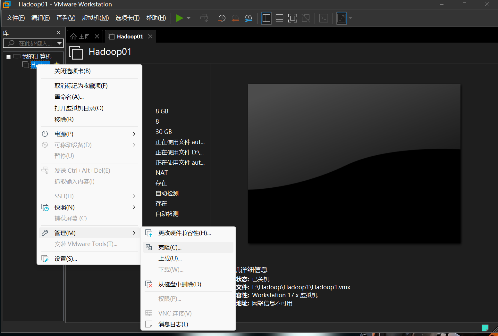
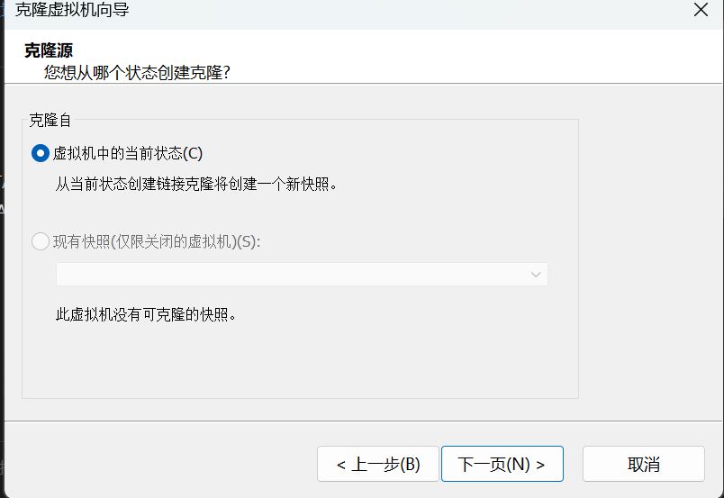
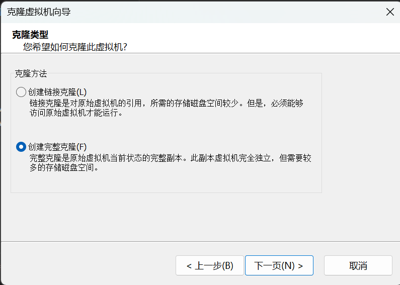
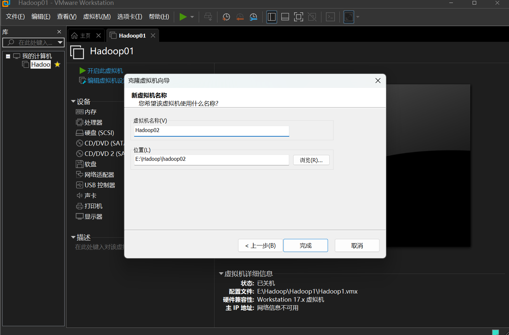
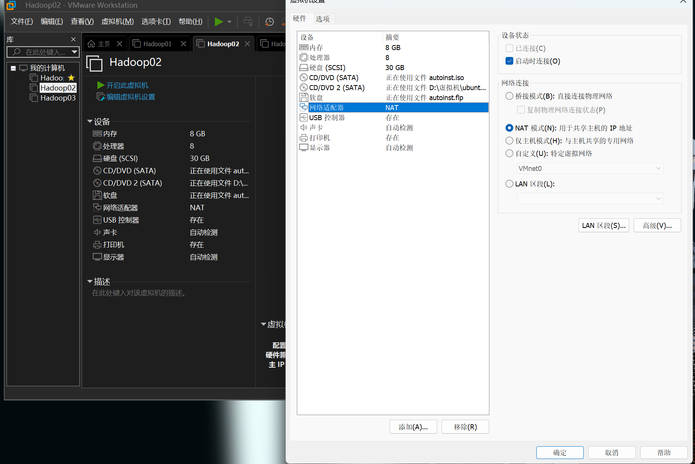
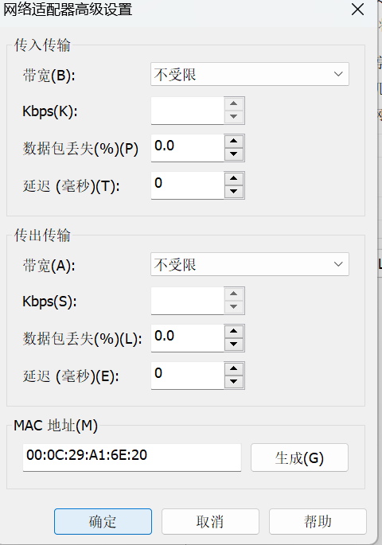
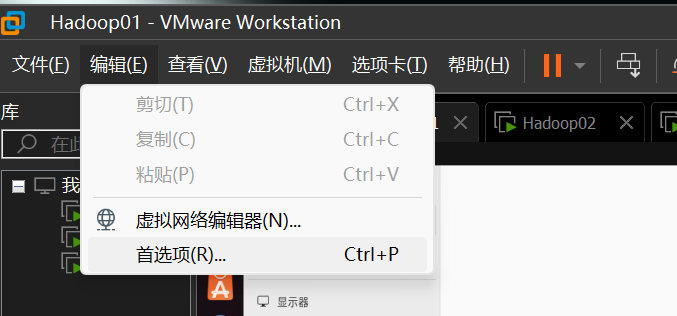
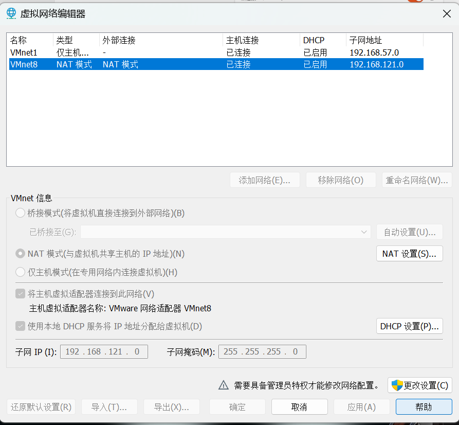
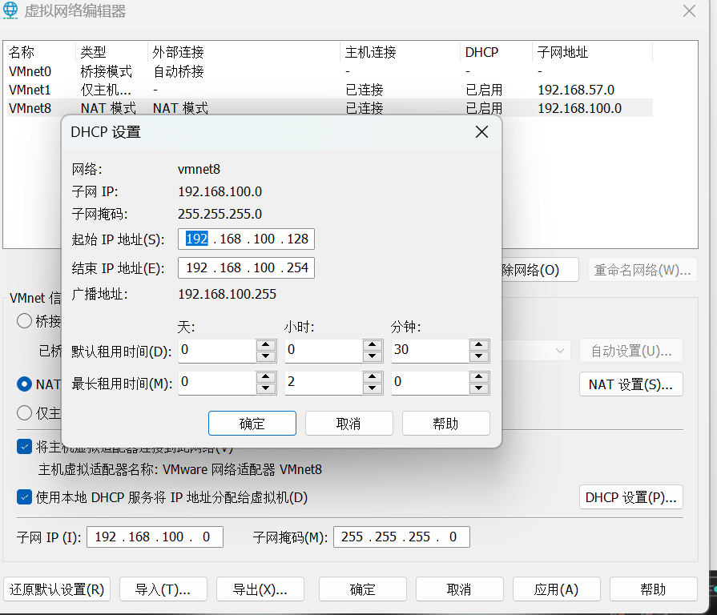

```markdown

```

# **在伪分布的基础上进行集群部署**

## **克隆虚拟机**









这里的目录选择自己的储存位置




## 更新网卡信息




点击高级




点击生成

## 修改VM ware  DHCP设置



点击虚拟网络编辑器



点击右下角更改设置后才能点击  DHCP设置




改成这个样子（注意左下角的子网IP也需要更改）

## 修改hdfs-site.xml文件

在hadoop02机器中   将其中的 value 行中的文件地址修改为（hadoop03同理改为data3）

/usr/local/hadoop/tmp/dfs/data2

```bash

  <property>
    <name>dfs.datanode.data.dir</name>
    <value>file:/usr/local/hadoop/tmp/dfs/data</value>
  </property>

```

## 分发ssh密钥

（三台机器都输一遍以下命令）

```bash
ssh-copy-id hadoop@hadoop01
ssh-copy-id hadoop@hadoop02
ssh-copy-id hadoop@hadoop03
```

## 删除tmp临时目录

（三台机器都需要删除）

```bash
rm -rf /usr/local/hadoop/tmp
```

## 重新格式化namenode

在hadoop01中输入

```bash
hdfs namenode -format
```

## 启动hadoop集群

在hadoop01中启动